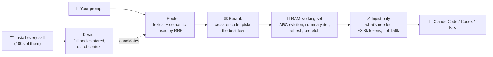

# Skill-RAM

**Your agent is drowning in skills it will never use on this prompt.** Every skill you install is re-read into context on every turn, a tax you pay on all of them, forever, to use two. Install 100 skills and you've quietly wrecked your context window.

Skill-RAM ends the tax. It vaults every skill, routes each prompt with a local model, and injects **only** the instructions the task actually needs. Then it does what nothing else does: it treats loaded skills like **RAM**, a working set with a real replacement policy, a summary tier, and prefetch, so the right skills stay resident across a long session and the rest get out of the way.

```sh
npx skillram install
```

---

## The numbers

Measured locally on the public [SkillRouter Eval Core](https://github.com/zhengyanzhao1997/SkillRouter) and [SKILLRET](https://github.com/ThakiCloud/SKILLRET) benchmarks. Every figure is reproducible, and the commands are below.

### 🔥 97.6% of your skill-context tokens, gone

On a 2,000-skill pool, the model used to stare at **~156,000 tokens of skills it didn't need** before writing a line. Skill-RAM cuts that to **~3,800**.

| | Before | After |
| --- | --- | --- |
| Skill context per prompt | ~156,300 tokens | **~3,800 tokens** |
| Across 75 prompts | the whole catalog, every turn | **~11.4M tokens avoided** |

### 🎯 It still puts the *right* skill in front of the model

Retrieval fuses lexical and semantic candidates, then lets a cross-encoder reranker make the final call:

| Routing | Hit@1 |
| --- | --- |
| Naive lexical routing | 64.7% |
| **Skill-RAM (RRF + reranker)** | **91.3%** |

That is **+26.6 points** from routing the right way. No bigger model, all local.

### 🧠 The part nobody else has: memory that keeps what matters

Loading the right skill once is easy. Keeping it resident across a 60-turn session, as the conversation drifts, compacts, and comes back, is where everything else falls apart. When context compacts and something must go, here is how much of the still-relevant working set survives:

| Eviction strategy | Working set retained |
| --- | --- |
| Index order (what everyone effectively does) | **36%** |
| **Skill-RAM (ARC / working-set policy)** | **up to 76%** |

Naive eviction throws away **two-thirds** of the skills your task still needs. Skill-RAM protects the ones you keep coming back to.

---

## How it works



Install once, and every skill body moves into a private vault, out of the model's context. On each prompt, a local router scores the vaulted skills, a reranker reads the top candidates in full and picks the best, and only those instructions are injected. The session layer remembers what stayed resident, so across a long conversation the right skills persist and the rest never return.

---

## Why you won't go back

- **Install 500 skills like it costs nothing**, because now it nearly does.
- **Your best skills stop getting evicted** at the worst moment. The memory hierarchy protects the working set across compaction.
- **Zero setup for semantic routing.** The default embedding model runs *in-process*, with no Ollama, no Python, and no GPU. It just works after install.
- **Nothing leaves your machine.** Local models, local routing, local everything. No keys, no cloud, no telemetry.
- **Fully reversible.** One `uninstall` puts every skill back byte for byte.
- **Claude Code, Codex, and Kiro today.** One hook per agent, push-style routing for all three. Kiro gets a workspace hook at `<project>/.kiro/hooks/skillram.json` that reads the prompt from `USER_PROMPT` and injects matching skills as context.
- **Honest counting.** Receipts are per harness — each agent has its own context window, so each gets its own box, deduplicated to what that agent actually loads (nested bundles, per-tool mirror copies, and symlink wrappers are indexed once from their canonical path).

---

## The RAM system

Skill-RAM's session layer is a cache, so it borrows what a cache needs:

- **Replacement policy:** an ARC (adaptive recency and frequency) policy decides what stays resident when context compacts, instead of arbitrary index order. Skills used in recent turns, the working set, are protected first.
- **Summary tier (L2):** skills the router ranked but didn't load are offered as ~40-token summaries, so a near-miss is recoverable ("ask for it by name") instead of invisible.
- **Refresh:** a skill loaded 40 turns ago, still relevant, gets its shape restated compactly before the model's attention decays.
- **Prefetch:** skills that co-occur in your history are speculatively warmed into the summary tier.
- **Overlays:** durable notes a session learns ("this repo uses pnpm") compose at load time, never modifying the original skill file.

## Retrieval

- **Fusion, not shortcuts.** Lexical and embedding candidates are merged by Reciprocal Rank Fusion (rank, not incomparable scores), and a reranker that reads each candidate in full makes the terminal decision.
- **Backends, your choice:**

  | Backend | Setup | Hit@1 |
  | --- | --- | --- |
  | **MiniLM (in-process), default** | none | 77.3% |
  | SkillRouter 0.6B encoder | Python + weights | **91.3%** |
  | Custom endpoint (Ollama-compatible) | your server | n/a |

  The default just works. Opt into the 0.6B encoder when you want peak accuracy.

---

## Quick start

```sh
# Preview every move, then vault skills and install the Claude + Codex (+ Kiro, when present) hooks.
npx skillram install --dry-run
npx skillram install

# See what each harness actually loads, one receipt per agent.
npx skillram receipt --provider all

# Inspect routing without loading instructions.
npx skillram route "review this React component"

# Restore every original directory and remove both hooks.
npx skillram uninstall
```

## Reproduce the numbers

```sh
# Token reduction + retrieval accuracy on the public pool, locally.
npx skillram eval-public /path/to/eval_core --tier hard --sample-tasks 75 --sample-skills 2000

# The memory hierarchy, retrieval held constant: same inputs, different eviction policy.
npx skillram eval-memory predictions.json relevance.json --compare
```

---

MIT licensed. Local-first. Reversible. Install every skill; load only what the task needs.
